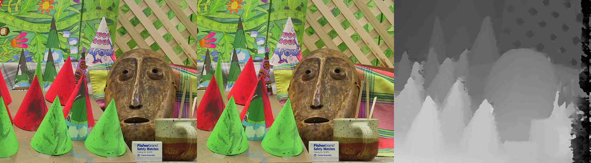

# Semi-Global Matching

Implementation of the Semi-Global Matching algorithm in Python.




#### Dependencies
* [OpenCV](https://opencv.org/)
* [NumPy](https://numpy.org/)

#### Instructions
```
$ git clone https://github.com/beaupreda/semi-global-matching.git
$ cd path/to/semi-global-matching
```

#### Usage
```
python3 sgm.py --left [LEFT IMAGE NAME] --right [RIGHT IMAGE NAME] --output [OUTPUT IMAGE NAME] --disp [MAXIMUM DISPARITY] --images [TRUE OR FALSE]
```

#### Example
```
python3 sgm.py --left cones/im2.png --right cones/im6.png --output disparity_map.png --disp 64 --images False
```

#### Other implementations
* [C++](https://github.com/epiception/SGM-Census)
* [MATLAB](https://github.com/kobybibas/SemiGlobalMathingImplementation)
* [CUDA](https://github.com/fixstars/libSGM)

#### References
* [Stereo Processing by Semi-Global Matching and Mutual Information](https://core.ac.uk/download/pdf/11134866.pdf)
* [LUNOKHOD SGM Blog Post](http://lunokhod.org/?p=1356)